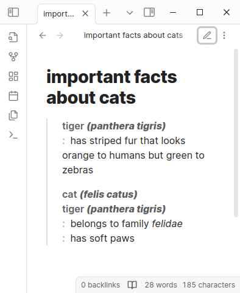

# Description Lists for Obsidian

This is a plugin for Obsidian (<https://obsidian.md>). It renders description lists in reading mode.

editing mode | reading mode
--- | ---
 | 

## what are description lists

Description lists are a feature of HTML. They were called _«definition lists»_ in HTML 4 but were renamed to _«description lists»_ in HTML 5. They are still sometimes called _«definition lists»_ — but we shall call them _«description lists»_, because this is in line with the current HTML standard and better reflects [the generality of their possible uses].

[the generality of their possible uses]: https://www.sitepoint.com/in-defence-of-the-definition-list/

In markdown, descriptions are denoted with a colon, like this:

``` markdown
tiger _(panthera tigris)_
: has striped fur that looks orange to humans but green to zebras
```

This markup is similar to what you would see in some printed dictionaries, say from Merriam-Webster.

There [can be one or more terms and one or more details] in a description:

[can be one or more terms and one or more details]: https://www.w3.org/WAI/WCAG21/Techniques/html/H40.html

``` markdown
cat _(felis catus)_
tiger _(panthera tigris)_
: belongs to family _felidae_
: has soft paws
```

One or more consecutive descriptions make a description list.

### description lists and Obsidian

Obsidian's markdown engine does not support description lists. This feature [has been requested since forever][forum] but there is no indication so far that any progress will  happen along official channels. We have to take care of the matter ourselves.

[forum]: https://forum.obsidian.md/t/add-support-for-definition-lists/224

## how this plugin solves the problem

When you switch from editing mode to reading mode, Obsidian renders your markdown into HTML, then displays this HTML. We intercept this rendered HTML and find all elements in it that look like they have some descriptions in them. We decide if an element looks like a description by parsing its children nodes with a special description parser — if the parse succeeds, we have the descriptions at hand. We then construct new description list HTML code from these descriptions and swap it in.

Technically, we do this by defining a [post-processor] and some [parser combinators].

[post-processor]: https://docs.obsidian.md/Plugins/Editor/Markdown+post+processing
[parser combinators]: https://www.cs.nott.ac.uk/~pszgmh/monparsing.pdf

### style

The philosophy of styling is to make description lists distinctive but not outstanding.

* Description lists are styled with a line on the left — like blockquotes, but of subdued colour.
* Description terms are rendered in faded bold font.
* Description details are rendered like bullet lists, but with a faded bold colon instead of a bullet.

### what we cannot do

1. We cannot handle block elements, like paragraphs and lists, inside descriptions. Since description lists are themselves block elements, this also means that we cannot handle nested description lists. Block elements are defined in markdown by whitespace, and Obsidian strips whitespace, so we do not have the information needed to handle block elements.

2. We cannot group consecutive descriptions at the top level into a description list, because Obsidian's rendering engine is incremental — it gives our post-processor one top level paragraph at a time, with no way to access the context. However, we fake this by making consecutive description lists at the top level look like a single description list.

## prior art

* Turns out [there is already a plugin][plugin] called _Definition List_ that has the mission of rendering description lists. Too bad I was not aware of it until after I wrote mine.

  Differences:

  - The other plugin takes a much simpler approach to the problem. The code is way shorter and easier to handle than of our plugin.
  - The other plugin does not seem to be able to handle inline markup at the moment.
  - The other plugin does not seem to be able to handle multiple terms or details within one description at the moment.

  [plugin]: https://github.com/shammond42/definition-list

## how to install and develop

### installing with BRAT

[BRAT] — fully, _Beta Reviewers Auto-update Tester_, — is a plugin that lets you install other plugins that are published on GitHub, whether or not they are registered with the Obsidian government as community plugins. In particular, you can install this plugin with BRAT. Follow the official instructions, it should work. However, it can only install released versions — if you want to install the latest source, follow the subsection [installing
manually](#installing-manually).

[BRAT]: https://github.com/TfTHacker/obsidian42-brat

### installing manually

We use [classic `yarn`] as a package manager. You need to have it installed — follow the instructions on their official site as needed.

[classic `yarn`]: https://classic.yarnpkg.com/

- Run `yarn` and `yarn build` to build `main.js`.
- Copy over `main.js`, `styles.css`, `manifest.json` to your vault
    `VaultFolder/.obsidian/plugins/description-lists/`.

### standard operations

- Run `yarn` to install dependencies.
- Run `yarn build` to build `main.js`
- Run `yarn dev` to automatically build `main.js` whenever relevant files change.
- Run `yarn test` to automatically run the test suite whenever relevant files change.
- Run `yarn format` to tidy up the whitespace.
- Run `yarn lint` to make sure nothing is overly stupid.
- Run `yarn check-coverage` to run the test suite and see how well it covers the code base.
- Run `yarn version --patch`, `yarn version --minor` or `yarn version --major` to automatically update version everywhere it needs to be updated.

### quality control

There is a health check workflow running on pull requests. The `master` branch is protected so a pull request cannot be merged until it passed the health check. In particular, it is being checked that:

- the linter has nothing to say
- the formatting is in line with the standard
- the test suite passes and has full coverage

### releasing

* Automatically update versions in `manifest.json`, `package.json` and `versions.json` by running `yarn version`.
* Make a commit and merge it to `master`.
* Tag the merged commit with the version number — without any decorations like `v` or whatever, only the version number. Note that this will be a different commit from what you had in the branch being merged _(because GitHub changes commits in subtle ways when merging)_, so you have to attach a tag after you merge.
* Push this tag with `git push --tags`.
* Watch the new version automatically built by the `release` workflow and added as a draft release.
* The draft release can be made public by hand in the GitHub web interface.
